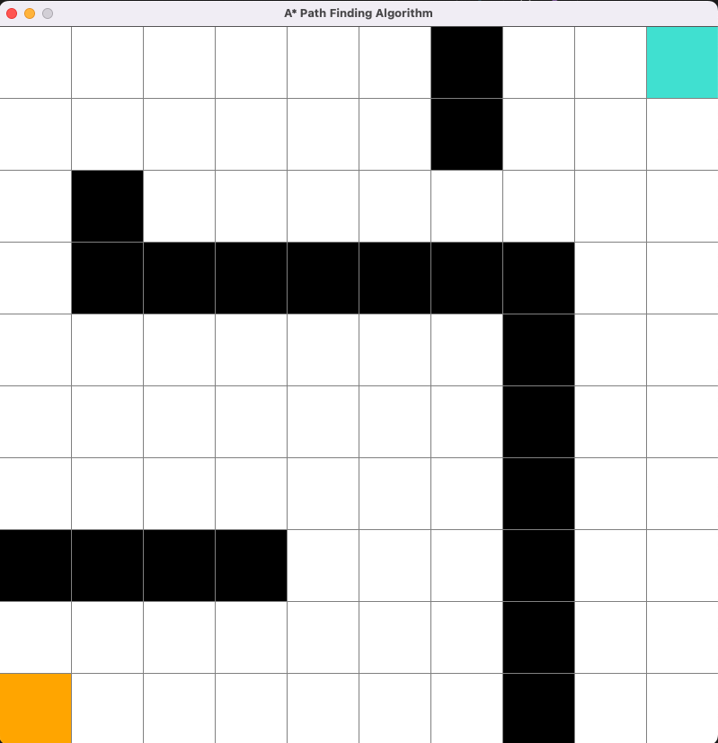
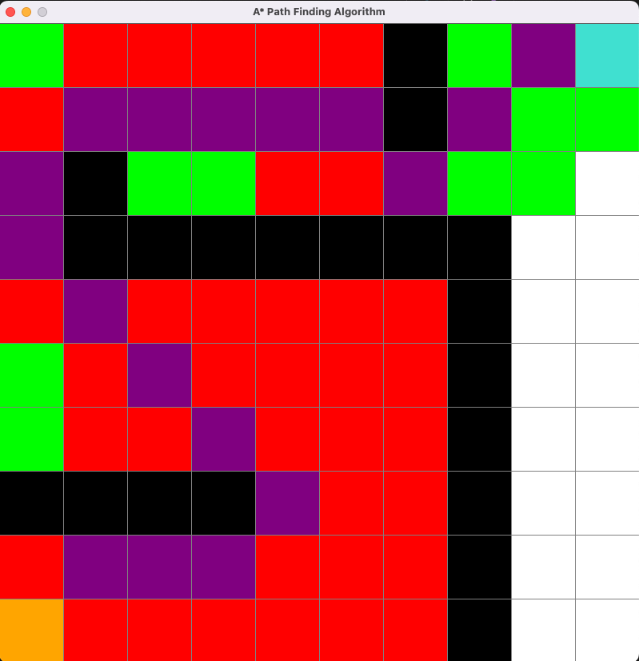

# astar_pathfinding
A* pathfinding algorithm visualizer with diagonality consideration

## Requires pygame to run locally
https://www.pygame.org/wiki/GettingStarted

## Instructions

First click sets starting point

Second click sets end point

Third click sets barriers

Right click to erase

"Space" to start

"c" to clear

Credit:
@techwithtim

